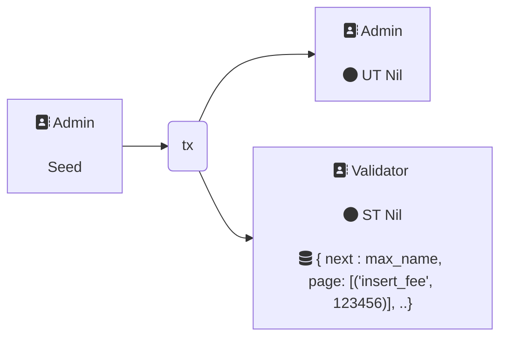
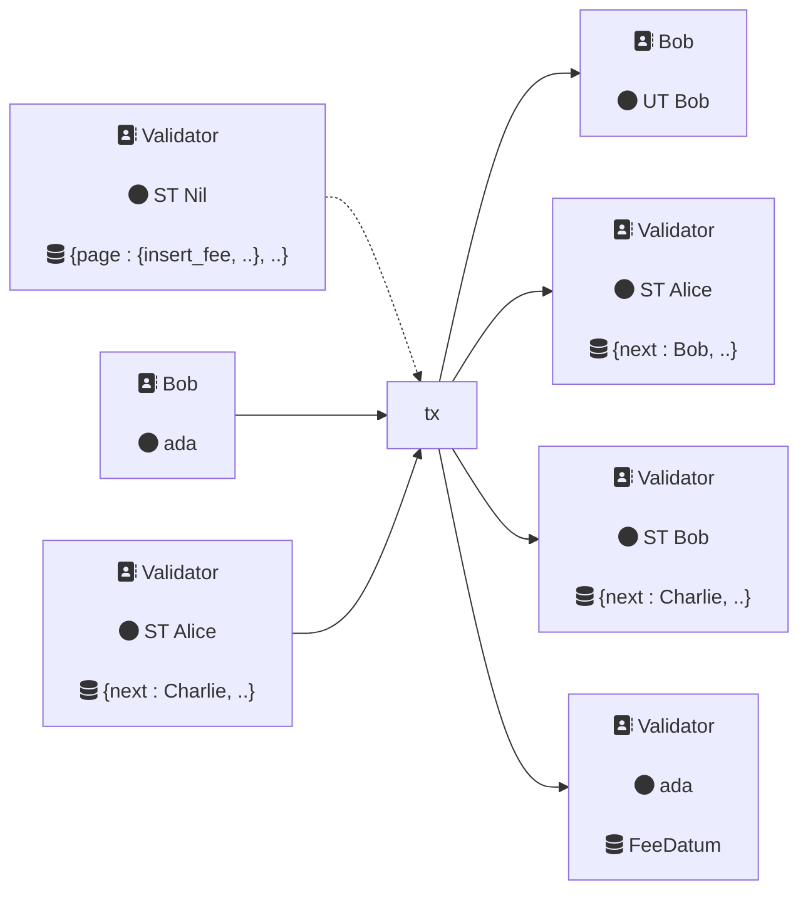
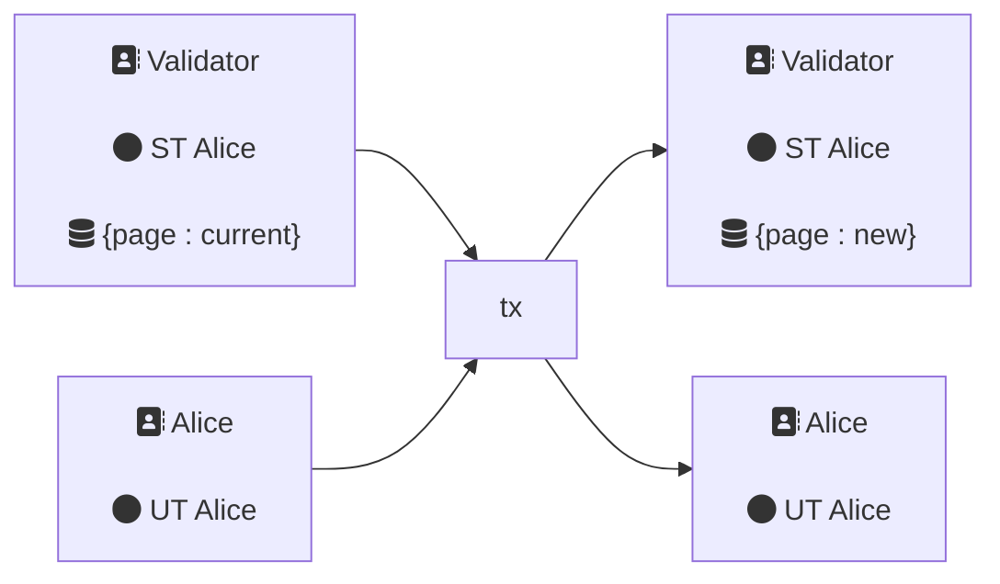
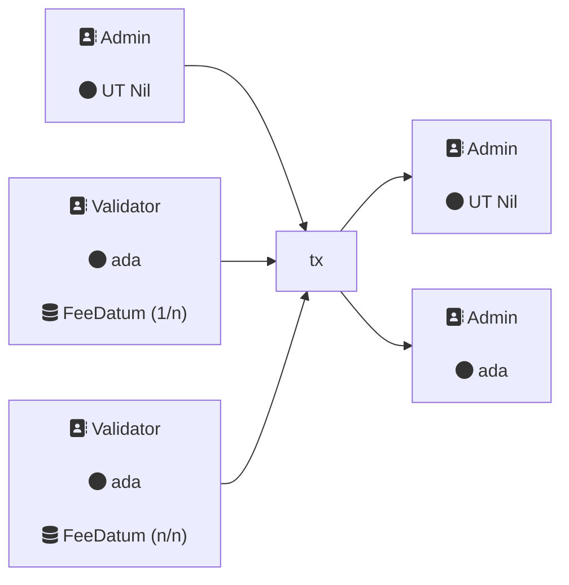
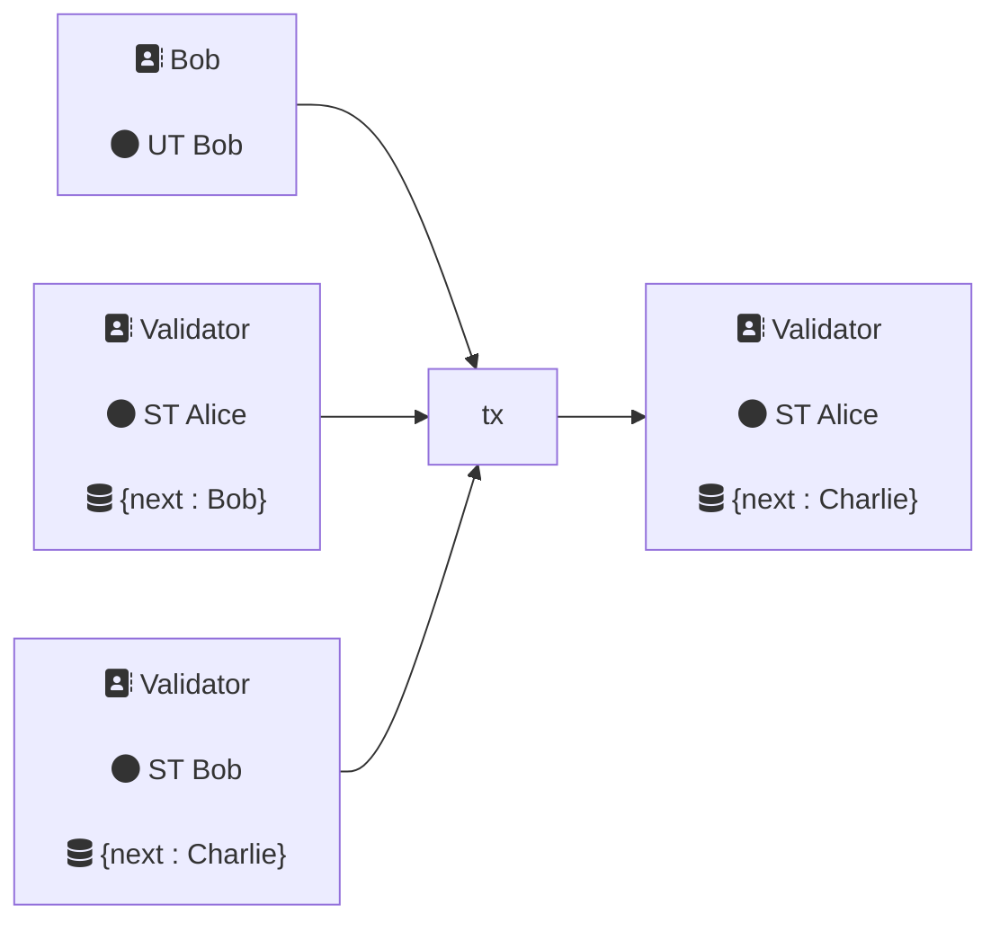
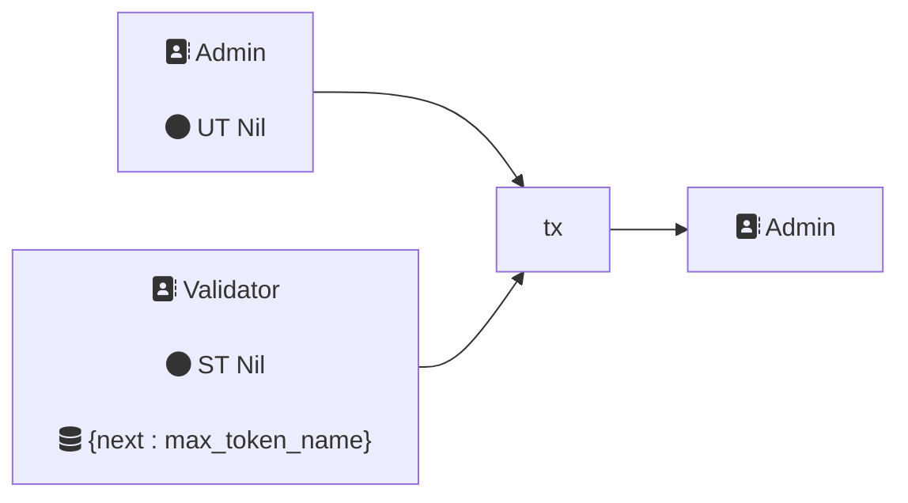

# Intro

This document contains:

- A non-technical overview of how the dapp works
- A specification:
  - in terms of transactions (txs)
  - of datatypes
- A description of terms
- Additional comments

## Dapp overview

The dapp is akin to a decentralised about-me page. Users attain a unique
username, and are able to put in data and modify (replace) their **page**. This
is then taken and formatted into a frontend (out of scope).

From the user's perspective the dapp is as follows: A user creates an account.
They must acquire a unique username. They put their initial data on-chain. From
this point forward, the user may modify this data (or more precisely write new
data on-chain which we recognize as the new, correct value). The user may also
wish to decommission their account, which removes the data from the chain.

From a technical perspective, the data on-chain is organised as a sorted linked
list. To make a new token it must be inserted into the list. The presence of a
validity token verifies the datum's legitimacy, and each datum references the name
of the next item of the list (ie just like a linked list).

### Interop

The dapp will follow cip-68 in order to increase interoperability. The cip-68
proposal is [here](https://cips.cardano.org/cips/cip68/).

When a user creates an account they mint two tokens:

- a **user token**
- a **script token**, aka reference NFT

cip-68 specifies that these tokens have labels appearing at the beginning of the
asset name:

- user token: label 222
- script token: label 100

The precise encoding is specified in
[cip-67](https://cips.cardano.org/cips/cip67/)

## Agents and validators

Participants of processes of the dapp are known as **agents** and have a
corresponding payment address.

- User: pays ADA for an Atrium NFT, updates their own data.
  The names Alice, Bob, _etc_ are used to represent users.
- Admin: Atrium administrator, receives payment for minting

Admin represents essentially a single entity, while user is representative of
many participants.

There is a single multi-purpose validator that includes both spend and mint logic.
We'll refer to the validator address as 'Validator'.

In line with cip-68 there are two types of tokens. The script tokens are locked
at the validator address and each has a corresponding user token.

## Txs

A transaction consists of inputs and outputs of utxos. Each utxo has a

- unique reference,
- an address it belongs to
- a value of ada + native assets (possibly no native assets)
- maybe a datum or datum hash. If the utxo belongs to a validator address, it must
  have a datum or datum hash.

Addresses correspond to either agents, or validator addresses. All transactions
must have at least one input that belongs to a payment address _ie_ an agent's
address.

In the following diagrams, boxes denote utxos. Owners of an address are stated
first, then any notable assets or ada (that is, ignoring min ada or ada value
that doesn't change or change is negligible, or other tokens that are not relevant),
then datums where relevant. All datums are assumed inline unless stated otherwise.

### `tx.init`

In the beginning admin creates the first token.



The init is _seeded_. That is a utxo specified in the params is spent.
Thus the validator address and policy id are unique to an init.
Any other initialization will have a different address and policy id.

The initial script token has a corresponding user token that is treated as an
admin token. These have an empty name, denoted here by "Nil".

That the name is represented by an empty bytearry means that it is
the 0th element of all bytearray under the standard ordering.
As we construct the list of all pages on-chain, the admin token
will always be first in line.

The bytearray `max_name = [0xff; 28]`.
The label is 4 bytes; while the max token name on the ledger is 32.
Thus this is the max token name

Constraints:

1. Redeemer is `MintInit`
2. Spend seed
3. Mint precisely cip-68 pair
4. Own name is empty
5. 0th output:
   1. address is own address
   2. value has non ada value equal to script token
   3. datum is "Init" data

Notes:

1. The init data includes costings.
2. The staking key is fixed here.

### `tx.mint`

To create a page, a user must mint a token. They must insert their page into the
existing list. Thus they must update the datum corresponding to entry
immediately preceeding the new page.

Suppose user "Alice" and user "Charlie" already have pages, and that in the ordering there is
no user between Alice and Charlie. New user "Bob" must involve script token "Alice" in the mint tx in
order to update the list.



Mint constraints:

1. Redeemer is `MintMint`
2. Must spend script token with redeemer `SpendInsert`

Spend constraints:

1. Redeemer is `SpendInsert`
2. Mint precisely cip-68 pair with name `mint_name`
3. Own name is strictly between own name and own next
4. New name is strictly between own name and own next
5. 0th output is continuing output:
   1. address is own address
   2. value is ada and own script token
   3. datum is own datum with update `next : mint_name`
6. 1st output is new output:
   1. address is own address
   2. value is ada and script token with name `mint_name`
   3. datum has: version as own version; `next` as own next; `page` size less than `max_page_size`
7. 2nd output is fee output:
   1. address is own address
   2. value is ada `>= insert_fee`
   3. datum is fee datum

### `tx.update`

A user updates their page by supplying new data while spending their user token.



Constraints:

1. Redeemer is `SpendUpdate`
2. 0th output is continuing output:
   1. address is own address
   2. value is ada and own script token
   3. datum is own datum with updated `page : new_name` and `page` size less than `max_page_size`
3. 1st output is user output:
   1. value is ada and user token

### `tx.collect`

Admin collects fees



Constraints:

1. Redeemer is `SpendCollect`
2. Own input contains no script token
3. 0th output is admin output:
   1. value has admin user token

Note:

1. Mutliple fees are collected simultaneously.
2. We check the admin user token in the output, rather than input
   for no reason other than it is more convenient.

### `tx.burn`

This is the inverse of minting.



Mint constraints:

1. Redeemer is `MintBurn`
2. Script token redeemers includes `SpendBurn` and `SpendRemove`

`SpendBurn` constraints:

1. Burn precisely cip-68 pair with own name

`SpendRemove` constraints:

1. Burn precisely cip-68 pair with name `mint_name`
2. Own next is mint name
3. 0th output is continuing output:
   1. Address is own address
   2. Value is ada and own script token
   3. Datum is own datum with updated `next : burn_next`.
      Here burn next is found on the datum spent with `SpendBurn`.

Notes:

1. The dependency requires some global constraints to be well-formed.
   Both spends check the mint value is in fact a burn.
   Neither check the redeemer.
   The only other mint action able to burn tokens is with `MintEnd`,
   and here would be impossible since it will only validate if spend redeemers as `SpendEnd`.
2. Then mint checks two spends, so there is no possibility that one spend can take place in the absence of the other.

### `tx.end`

This is the inverse of `tx.init`.



Mint constraints:

1. Redeemer is `MintEnd`
2. Script token redeemers is `SpendEnd`

Spend constraints:

1. Redeemer is `SpendBurn`
2. Own name is empty
3. Own next is max token name
4. Burn precisely cip-68 pair with name own name

Note:

1. Only a singleton list can be ended. That is there are no users left.

## Data

### Params

```aiken {.language-aiken}
type Params {
  seed: OutputReference,
  max_page_size: Int,
}
```

The seed ensures the instance has a unique policy id and address.

### Datum

The datum is mostly determined by cip-68.
For example, the version number is to be compatible with cip-68.

```aiken {.language-aiken}
type Datum {
  page: Page,
  version: Int,
  next: Name,
}
```

We have the following type aliases

```aiken {.language-aiken}
type Page =
  Dict<ByteArray, Data>

type Name =
  ByteArray
```

The admin datum must have the key "insert_fee" in its page.
The correponding value must be coercible to an integer.
This is referenced during a mint transaction.

The fee datum is

```aiken {.language-aiken}
  Datum { page: dict.new(), version: -999, next: "" }
```

in order to passable when spent.

### Redeemers

For mint purpose

```aiken {.language-aiken}
type RedMint {
  MintInit
  MintMint
  MintBurn
  MintEnd
}
```

For spend purpose

```aiken {.language-aiken}
type RedSpend {
  SpendInser
  SpendUpdate
  SpendCollect
  SpendBurn
  SpendRemove
  SpendEnd
}
```

## Design notes

### Explicit coupling

The only tx in which the mint validator is invoked without a spend validator
is the init.

We choose to make it explicit that every other time the mint validator is
invoked it checks the spend validator has the correct redeemer(s). All other
constraints are within the spend validator, including the mint value.

There is some redundancy but it is not expensive and makes explicit that it is
illegal for a transaction to have redeemers for mint and spend validators that
are intended for different actions.

### Parameterized uniqueness

An init will have a unique script hash: the admin token can only be minted once.
Every init will have a unique policy id.

### Bytearray ordering

For bytearrays $a,b$ then $a < b$ provided that there exists some $0 \leq k$
such that for all $0 \leq i < k$ then $a_i = b_i$ and either the length of $a$
is $k$ or $a_k < b_k$.

For example $$ [1,2] < [1,3] . ~~ [1,2] < [1,2,3] $$

### Asset names

cip-67 and 68 specify that the prefix of the asset names of the tokens are (in
base16)

- `000643b0` for the script token
- `000de140` for the user token

These are precisely the asset names of the admin tokens. The references of
"name" are the remaining bytes of the asset name.

### cip-68

Here is a data definition from cip-68

```cddl {.language-cddl}
files_details =
      {
        ? name : bounded_bytes, ; UTF-8
        mediaType : bounded_bytes, ; UTF-8
        src : bounded_bytes ; UTF-8
        ; ... Additional properties are allowed
      }

 metadata =
      {
        name : bounded_bytes, ; UTF-8
        image : bounded_bytes, ; UTF-8
        ? mediaType : bounded_bytes, ; UTF-8
        ? description : bounded_bytes, ; UTF-8
        ? files : [* files_details]
        ; ... Additional properties are allowed
      }

    ; Custom user defined plutus data.
    ; Setting data is optional, but the field is required
    ; and needs to be at least Unit/Void: #6.121([])
extra = plutus_data

datum = #6.121([metadata, 1, extra]) ; version 1
```

The design of the `Datum` differs from this in two ways:

1. page is a relaxation of the metadata field. There are no manditory fields.
2. extra is bytearray of the next name.

Thus, there is potential for interoperability. For example, if program displays
the name and image of cip-68 tokens, and a user has set these fields, then this
tool should display them.

## Glossary

### Cardano Related

- Validator
  - A Plutus script which contains the logic for what is necessary to spend the
    funds locked at its address, or mint/burn assets of a specific PolicyID. For
    more info see
    [here](https://plutus.readthedocs.io/en/latest/tutorials/basic-validators.html?highlight=validator)
- Redeemer
  - Input data provided to a script. For more info see
    [here](https://plutus.readthedocs.io/en/latest/simple-example.html?highlight=redeemer#the-eutxo-model-datum-redeemer-and-script-context)
